# Architecture — ArXiv RAG Pipeline

## System Overview

The ArXiv RAG system consists of two main pipelines:

1. **Offline Indexing Pipeline** — Processes papers into a searchable vector index
2. **Online Query Pipeline** — Handles user queries in real-time

```mermaid
graph TB
    subgraph Offline["📥 Offline Indexing Pipeline"]
        direction TB
        A["🌐 ArXiv API"] -->|"arxiv library"| B["📄 PDF Download"]
        B -->|"50-100 papers"| C["📝 Text Extraction<br/>(pdfplumber + PyPDF2)"]
        C --> D["✂️ Chunking<br/>(512 chars, 50 overlap)"]
        D --> E["🧮 Embedding<br/>(all-MiniLM-L6-v2, 384d)"]
        E --> F["📦 FAISS Index<br/>(IndexFlatIP)"]
        F --> G["💾 Saved to Disk<br/>(index.faiss + chunks.pkl)"]
    end

    subgraph Online["🔍 Online Query Pipeline"]
        direction TB
        H["❓ User Query"] --> I["🧮 Query Embedding<br/>(all-MiniLM-L6-v2)"]
        I --> J["🔍 FAISS Search<br/>(Top-K nearest neighbors)"]
        J --> K["📋 Context Assembly<br/>(Top-K chunks + metadata)"]
        K --> L["🤖 LLM Generation<br/>(OpenAI / Ollama)"]
        L --> M["💬 Answer + Sources"]
    end

    G -.->|"Load index"| J

    style Offline fill:#1a1a2e,stroke:#667eea,stroke-width:2px,color:#fff
    style Online fill:#1a1a2e,stroke:#764ba2,stroke-width:2px,color:#fff
```



---

## Component Details

### 1. Data Collection (`collect_papers.py`)

| Setting | Value | Rationale |
|---------|-------|-----------|
| API | `arxiv` Python library | Official, rate-limited, reliable |
| Categories | `cs.AI`, `cs.CL`, `cs.CV` | Core AI/ML research areas |
| Volume | 50–100 papers | Sufficient for meaningful retrieval without excessive processing |
| Sort | `submittedDate` (descending) | Prioritizes recent research |

### 2. Text Extraction (`PDFTextExtractor`)

```mermaid
graph LR
    A["PDF File"] --> B{"pdfplumber"}
    B -->|"Success"| C["Extracted Text"]
    B -->|"Fail"| D{"PyPDF2"}
    D -->|"Success"| C
    D -->|"Fail"| E["⚠️ Skip Paper"]
```



- **Primary**: `pdfplumber` — Better handling of academic layouts, tables, multi-column
- **Fallback**: `PyPDF2` — Simpler but more robust for basic text extraction

### 3. Chunking Strategy (`TextChunker`)

| Parameter | Value | Justification |
|-----------|-------|---------------|
| Method | `RecursiveCharacterTextSplitter` | Splits hierarchically: paragraphs → sentences → words |
| Chunk Size | 512 characters | Captures 1–2 academic paragraphs; balances context vs precision |
| Overlap | 50 characters | ~10% overlap prevents boundary information loss |
| Separators | `\n\n`, `\n`, `. `, ` `, `` | Prioritizes natural text boundaries |

**Why recursive splitting?**
- Respects document structure (paragraph boundaries first)
- Falls back gracefully to smaller units
- More semantically coherent than fixed-size windows

### 4. Embedding Model (`EmbeddingEngine`)

| Property | Value |
|----------|-------|
| Model | `all-MiniLM-L6-v2` |
| Dimensions | 384 |
| Parameters | ~22M |
| Size | ~14 MB |
| Training | 1B+ sentence pairs (NLI + semantic similarity) |
| Normalization | L2-normalized (cosine = inner product) |

**Why this model?**
- Best quality/speed ratio for semantic similarity tasks
- Small enough for CPU inference
- Proven performance on MTEB benchmark
- Alternatives: `all-mpnet-base-v2` (768d, higher quality, slower)

### 5. Vector Store (`VectorStore` — FAISS)

| Property | Value |
|----------|-------|
| Index Type | `IndexFlatIP` (exact inner product) |
| Metric | Cosine similarity (via normalized IP) |
| Scale | 5K–50K vectors |
| Storage | `index.faiss` + `chunks.pkl` |

**Why FAISS?**
- Open-source (Meta AI), no server required
- Extremely fast ANN search (even exact search at this scale)
- Handles millions of vectors in-memory
- Alternatives: ChromaDB (simpler API), Pinecone (managed), Qdrant (Rust-based)

### 6. LLM Generation (`RAGPipeline`)


- **Prompt Template**: Instructs the LLM to use only retrieved context, cite sources, and refuse if context is insufficient
- **Temperature**: 0.3 (lower = more factual, less creative)
- **Fallback**: Returns raw retrieved passages if no LLM is configured

---

## Data Flow Summary

```
ArXiv (50-100 papers)
    ↓ collect_papers.py
PDFs + metadata.json
    ↓ PDFTextExtractor
Raw text documents (avg ~30K chars/paper)
    ↓ TextChunker (512 chars, 50 overlap)
~5K-10K text chunks
    ↓ EmbeddingEngine (all-MiniLM-L6-v2)
384-dim float32 vectors (~2-4 MB)
    ↓ FAISS IndexFlatIP
Searchable index (saved to disk)
    ↓ RAGPipeline.query()
Answer + cited sources
```

---

## Technology Stack

| Layer | Technology | Version |
|-------|-----------|---------|
| Data Collection | `arxiv` | 2.1.3 |
| PDF Processing | `pdfplumber`, `PyPDF2` | 0.11.4, 3.0.1 |
| Chunking | `langchain-text-splitters` | 0.3.4 |
| Embeddings | `sentence-transformers` | 3.3.1 |
| Vector Store | `faiss-cpu` | 1.9.0 |
| LLM | `langchain-openai` / `langchain-ollama` | 0.3.0 |
| Visualization | `matplotlib`, `seaborn`, `scikit-learn` | — |
| Web UI | `streamlit` | 1.41.1 |
